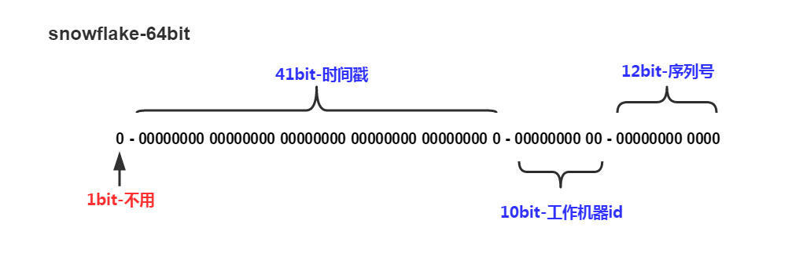

## ObjectId

| 时间戳 | 机器码 | PID  | 计数器 |
| ------ | ------ | ---- | ------ |
|0,1,2,3|4,5,6|7,8|9,10,11|


* 前四位是时间戳，可以提供秒级别的唯一性。
* 接下来三位是所在主机的唯一标识符，通常是机器主机名的散列值。
* 接下来两位是产生 ObjectId 的 PID(线程Id)，确保同一台机器上并发产生的 ObjectId 是唯一的。
* 最后三位是自增计数器，确保相同进程同一秒钟产生的 ObjectId 是唯一。

> 前九位保证了同一秒钟不同机器的不同进程产生的 ObjectId 时唯一的


## UUID

UUID 是由一组32位数的16进制数字所构成，是故 UUID 理论上的总数为1632=2128，约等于3.4 x 10123

UUID 的十六个八位字节被表示为 32个十六进制数字，以连字号分隔的五组来显示，形式为 8-4-4-4-12，总共有 36个字符（即三十二个英数字母和四个连字号）

```
6d25a684-9558-11e9-aa94-efccd7a0659b
xxxxxxxx-xxxx-Mxxx-Nxxx-xxxxxxxxxxxx
```

数字 `M` 的四位表示 UUID 版本，当前规范有5个版本，M可选值为1, 2, 3, 4, 5

* version 1, date-time & MAC address
* version 2, date-time & group/user id
* version 3, MD5 hash & namespace
* version 4, pseudo-random number (伪随机数)
* version 5, SHA-1 hash & namespace

数字 `N` 的一至四个最高有效位表示 UUID 变体( variant )，有固定的两位10xx因此只可能取值8, 9, a, b

### 版本
```shell
# uuid
brew install ossp-uuid
```
#### V1

```shell
uuid -n 10 -v1

294a6a92-be98-11eb-9dcb-0f1e76538a6d
294a6ce0-be98-11eb-9dcc-1bb4e66991ff
294a6d1c-be98-11eb-9dcd-971611eb04e6
294a6d44-be98-11eb-9dce-d3a5708e6b8b
294a6d6c-be98-11eb-9dcf-17e7f2960e02
294a6d8a-be98-11eb-9dd0-6b53d29cfffa
294a6db2-be98-11eb-9dd1-b3d280c04b83
294a6dda-be98-11eb-9dd2-7fa6a00a1d0e
294a6e02-be98-11eb-9dd3-b3fd98ca50cd
294a6e2a-be98-11eb-9dd4-6fb0ef6dbd4a
```

v1为了保证唯一性，当时间精度不够时，会使用13~14位的clock sequence来扩展时间戳

#### V2

#### V3

当namespace与输入参数确定时，得到的UUID都是确定唯一的

```shell
uuid -n 5 -v3 ns:URL http://www.baidu.com
2f67490d-55a4-395e-b540-457195f7aa95
2f67490d-55a4-395e-b540-457195f7aa95
2f67490d-55a4-395e-b540-457195f7aa95
2f67490d-55a4-395e-b540-457195f7aa95
2f67490d-55a4-395e-b540-457195f7aa95
```

* 把namespace和输入参数拼接在一起，如 "http/http://wwwbaidu.com" + "/query=uuid"
* 使用MD5算法对拼接后的字串进行hash，截断为128位
* 把UUID的Version和variant字段都替换成固定的
* 如果需要to_string，需要转为16进制和加上连接符"-"

#### V4

```shell
uuid -n 5 -v4
15707c90-85c9-4503-bb6e-cb6e3354335d
c22194fe-8d2a-4a2d-a9b3-5fe0ac16cb72
2af5bede-f471-4263-a2b7-5794ce357aa5
bd2de88d-a846-411b-ad80-7874fbb138f7
b2a0363b-c8d0-4b7a-9222-8b9f610305d5
```

java.util.UUID.randomUUID() 使用v4

## SnowFlake



1bit，不用，因为二进制中最高位是符号位，1表示负数，0表示正数。生成的id一般都是用整数，所以最高位固定为0。

41bit-时间戳，用来记录时间戳，毫秒级。
- 41位可以表示个数字，
- 如果只用来表示正整数（计算机中正数包含0），可以表示的数值范围是：0 至 ，减1是因为可表示的数值范围是从0开始算的，而不是1。
- 也就是说41位可以表示个毫秒的值，转化成单位年则是年

10bit-工作机器id，用来记录工作机器id。
- 可以部署在个节点，包括5位datacenterId和5位workerId
- 5位（bit）可以表示的最大正整数是，即可以用0、1、2、3、....31这32个数字，来表示不同的datecenterId或workerId

12bit-序列号，序列号，用来记录同毫秒内产生的不同id。
- 12位（bit）可以表示的最大正整数是，即可以用0、1、2、3、....4094这4095个数字，来表示同一机器同一时间截（毫秒)内产生的4095个ID序号