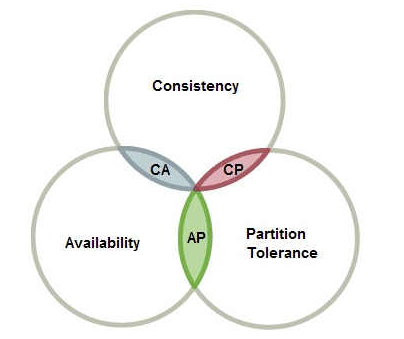
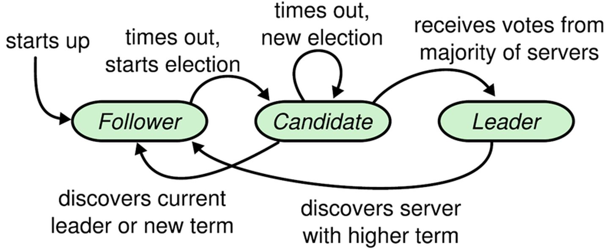
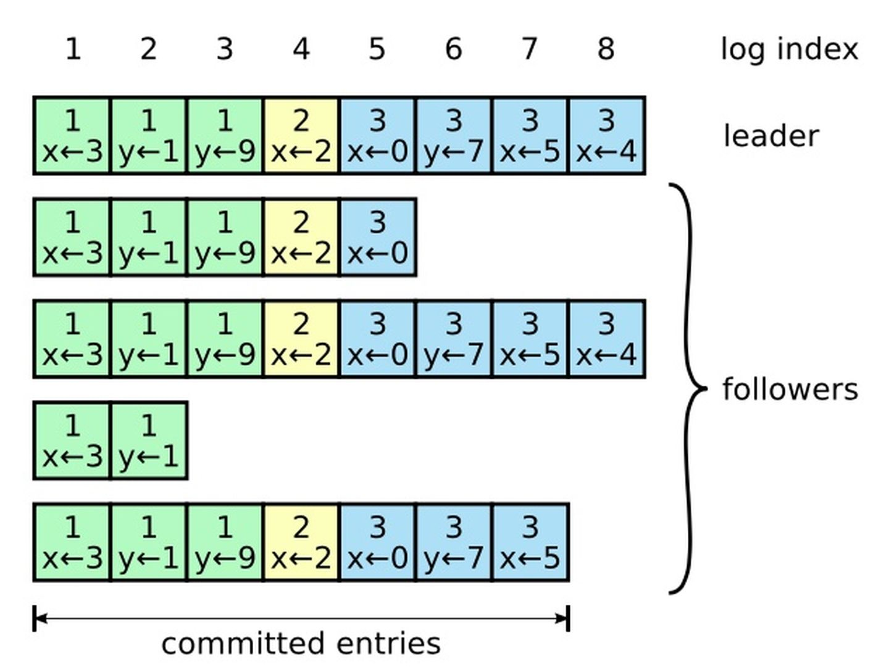
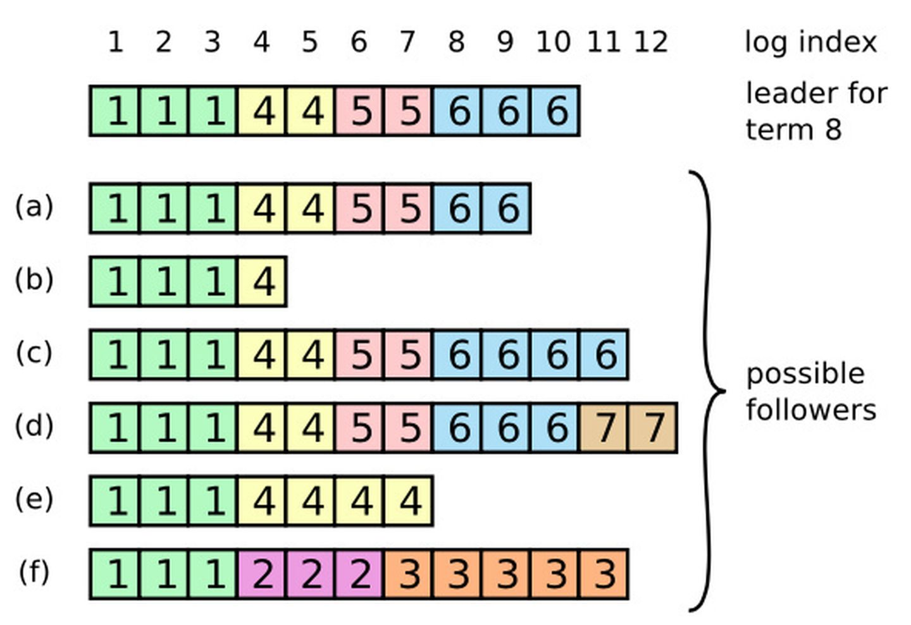
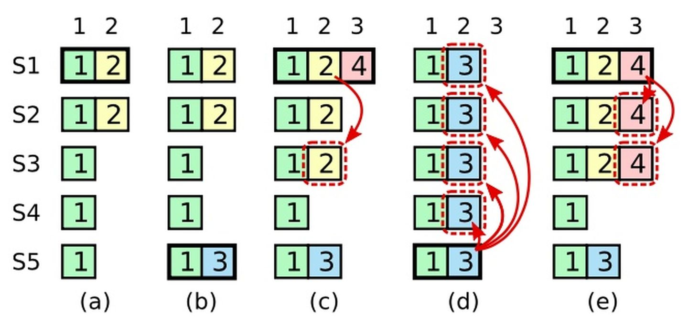
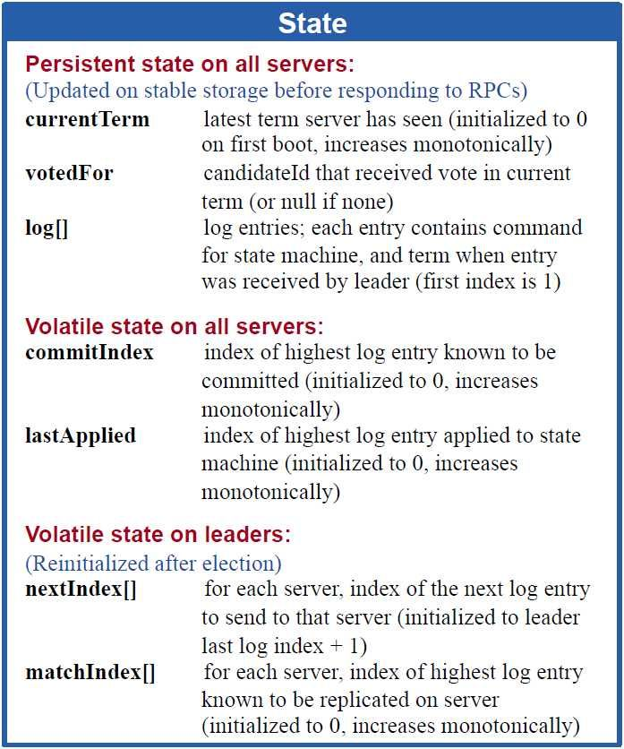
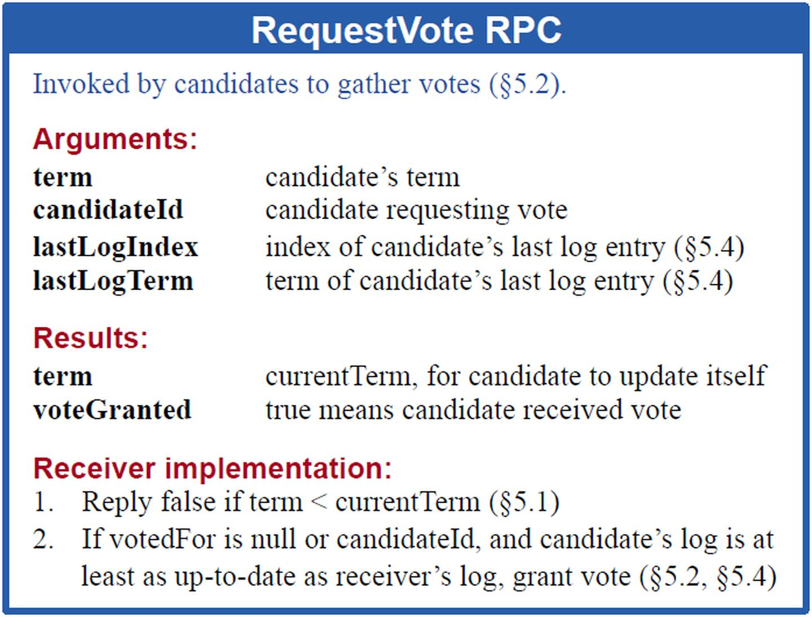
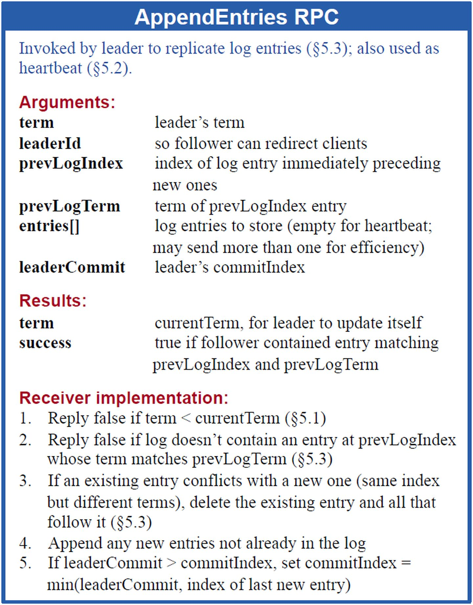
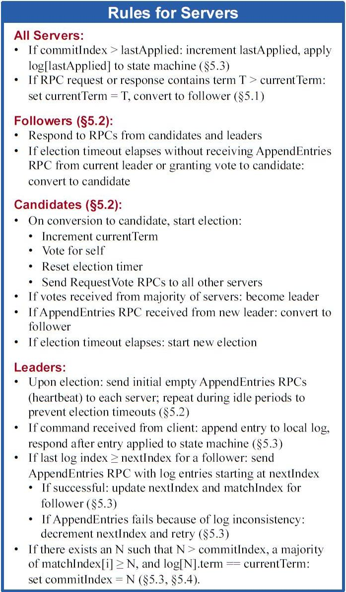
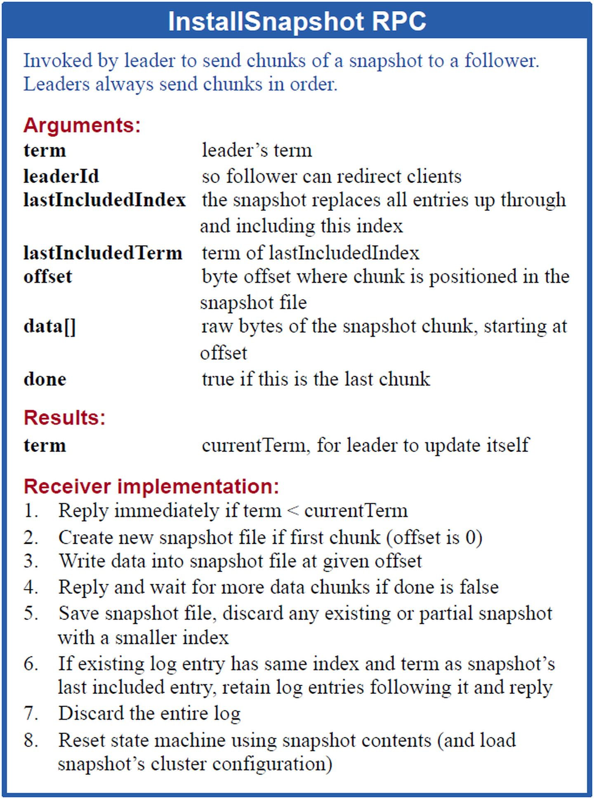

## 一致性

### CAP theorem（CAP 理论）

* 一致性（Consistency）
* 可用性（Availability）
* 分区容错性（Partition tolerance）

以上三个特性，同一时刻不能同时满足

> 在分布式系统的设计中，没有一种设计可以同时满足一致性，可用性，分区容错性 3个特性

### Base 理论

BASE(Basically Available, Soft State, Eventual Consistency  基本可用、软状态、最终一致性) 对CAP AP理论的延伸

核心思想
即使无法做到强一致性（Strong consistency），但每个应用都可以根据自身的业务特点，采用适当的方式来使系统达到最终一致性（Eventual consistency）

### 一致性模型
#### 弱一致性模型

这种一致性级别约束了系统在写入成功后，不承诺立即可以读到写入的值，也不承诺多久之后数据能够达到一致，但会尽可能地保证到某个时间级别（比如秒级别）后，数据能够达到一致状态

* DNS（Domain Name System）
* Gossip(Cassandra的通信协议)

#### 强一致性模型

* 同步
* Paxos
* Ratf(multi-paxos)
* ZAB(multi-paxos)

#### 最终一致性模型

最终一致性是弱一致性的一个特例，系统会保证在一定时间内，能够达到一个数据一致的状态

## Raft 算法

> Raft [rɑ:ft] 实现了和Paxos相同的功能，它将一致性分解为多个子问题
* Leader选举（Leader election）
* 日志同步（Log replication）
* 安全性（Safety）
* 日志压缩（Log compaction）
* 成员变更（Membership change）

Raft要求系统在任意时刻最多只有一个Leader，正常工作期间只有Leader和Followers

* Leader 接受客户端请求，并向Follower 同步请求日志，当日志同步到大多数节点上后告诉Follower提交日志
* Follower 接受并持久化Leader同步的日志，在Leader告之日志可以提交之后，提交日志
* Candidate 候选人 Leader选举过程中的临时角色

状态切换图:

Leader在宕机之前会一直保持Leader的状态

任期: 

Raft算法将时间分为一个个的任期（term），每一个term的开始都是Leader选举。在成功选举Leader之后，Leader会在整个term内管理整个集群。如果Leader选举失败，该term就会因为没有Leader而结束
### Leader选举

使用心跳（heartbeat）触发Leader选举，选举出Leader后，Leader通过定期向所有Followers发送心跳信息维持其统治

选举过程:

1. 当服务器启动时，初始化为Follower
2. Leader向所有Followers周期性发送heartbeat 
3. 如果Follower在选举超时时间内没有收到Leader的heartbeat，就会等待一段随机的时间后发起一次Leader选举
4. Follower将其当前term加一然后转换为Candidate
5. 首先给自己投票并且给集群中的其他服务器发送 RequestVote RPC

选举结果会出现的情况:

1. 赢得了多数的选票，成功选举为Leader
2. 收到了Leader的消息，表示有其它服务器已经抢先当选了Leader
3. 没有服务器赢得多数的选票，Leader选举失败，等待选举时间超时后发起下一次选举

### 日志同步

Leader把请求作为日志条目（Log entries）加入到它的日志中，然后并行的向其他服务器发起 AppendEntries RPC 复制日志条目。
当这条日志被复制到大多数服务器上，Leader将这条日志应用到它的状态机并向客户端返回执行结果

日志由有序编号（log index）的日志条目组成。每个日志条目包含它被创建时的任期号（term），和用于状态机执行的命令。如果一个日志条目被复制到大多数服务器上，就被认为可以提交（commit）

Raft日志同步保证如下两点：

* 如果不同日志中的两个条目有着相同的索引和任期号，则它们所存储的命令是相同的。
* 如果不同日志中的两个条目有着相同的索引和任期号，则它们之前的所有条目都是完全一样的。

上图阐述了一些Followers可能和新的Leader日志不同的情况。一个Follower可能会丢失掉Leader上的一些条目，也有可能包含一些Leader没有的条目，也有可能两者都会发生。丢失的或者多出来的条目可能会持续多个任期。

Leader通过强制Followers复制它的日志来处理日志的不一致，Followers上的不一致的日志会被Leader的日志覆盖。

Leader为了使Followers的日志同自己的一致，Leader需要找到Followers同它的日志一致的地方，然后覆盖Followers在该位置之后的条目。

Leader会从后往前试，每次AppendEntries失败后尝试前一个日志条目，直到成功找到每个Follower的日志一致位点，然后向后逐条覆盖Followers在该位置之后的条目

### 安全性

* 拥有最新的已提交的log entry的Follower才有资格成为Leader
> 这个保证是在RequestVote RPC中做的，Candidate在发送RequestVote RPC时，要带上自己的最后一条日志的term和log index，其他节点收到消息时，如果发现自己的日志比请求中携带的更新，则拒绝投票。日志比较的原则是，如果本地的最后一条log entry的term更大，则term大的更新，如果term一样大，则log index更大的更新
* Leader只能推进commit index来提交当前term的已经复制到大多数服务器上的日志，旧term日志的提交要等到提交当前term的日志来间接提交（log index 小于 commit index的日志被间接提交）

### 日志压缩

在实际的系统中，不能让日志无限增长，否则系统重启时需要花很长的时间进行回放，从而影响可用性。
Raft采用对整个系统进行snapshot来解决，snapshot之前的日志都可以丢弃

每个副本独立的对自己的系统状态进行snapshot，并且只能对已经提交的日志记录进行snapshot

日志内容:

* 日志元数据
> 最后一条已提交的 log entry的 log index和term。
> 这两个值在snapshot之后的第一条log entry的AppendEntries RPC的完整性检查的时候会被用上。

* 系统当前状态

当新加进一台机器时，也会发送snapshot给它。发送snapshot使用InstalledSnapshot RPC

### 成员变更

成员变更是在集群运行过程中副本发生变化，如增加/减少副本数、节点替换等

### Raft算法总结

#### 各节点维护的状态

#### Leader选举

#### 日志同步

#### Raft状态机

#### 安装snapshot

## Paxos 算法
## ZAB 算法

## 相关文档

* [The Raft Consensus Algorithm 实现库](https://raft.github.io)
* [raft 动画演示](http://thesecretlivesofdata.com/raft/)
* [raft 论文](https://raft.github.io/raft.pdf)
* [raft 论文中文翻译](https://github.com/maemual/raft-zh_cn)
* [raft 相关文章](https://zhuanlan.zhihu.com/p/32052223)