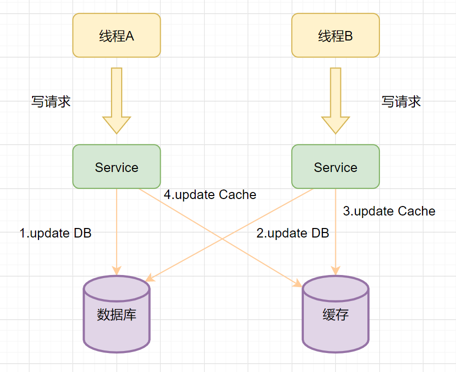

## 缓存模型

缓存可以提升性能、缓解数据库压力，但是使用缓存也会导致数据不一致性的问题。

经典的缓存使用模式: 

* Cache-Aside Pattern
* Read-Through/Write-through
* Write-behind

### Cache-Aside Pattern

旁路缓存模式，它的提出是为了尽可能地解决缓存与数据库的数据不一致问题

#### 读流程

1. 先读缓存，缓存命中，直接返回数据
2. 缓存没有命中，读数据库
3. 从数据库取出数据，放入缓存后
4. 返回响应

#### 写流程

**先更新数据库，然后再删除缓存**

> 防止并发场景，数据不一致

### Read-Through/Write-Through

Read/Write-Through(读写穿透) 模式中，服务端把缓存作为主要数据存储。
应用程序跟数据库缓存交互，都是通过抽象缓存层完成

#### 读流程

#### 写流程

### Write-behind

Write-Behind则是只更新缓存，不直接更新数据库，通过**批量异步**的方式来更新数据库

#### 流程

这种方式下，缓存和数据库的一致性不强，对一致性要求高的系统要谨慎使用

> 适合频繁写的场景，`MySQL` 的 `InnoDB Buffer Pool` 机制就使用到这种模式

### 场景1 操作缓存的时候，到底是删除缓存呢，还是更新缓存

1. 线程A先发起一个写操作，第一步先更新数据库
2. 线程B再发起一个写操作，第二步更新了数据库
3. 由于网络等原因，线程B先更新了缓存
4. 线程A更新缓存

这时候，缓存保存的是A的数据（老数据），数据库保存的是B的数据（新数据），数据不一致了，脏数据出现啦。

如果是删除缓存取代更新缓存则不会出现这个脏数据问题

> 更新缓存相对于删除缓存，还有两点劣势:
* 如果你写入的缓存值，是经过复杂计算才得到的话。更新缓存频率高的话，就浪费性能啦。
* 在写数据库场景多，读数据场景少的情况下，数据很多时候还没被读取到，又被更新了，这也浪费了性能呢(实际上，写多的场景，用缓存也不是很划算的,哈哈)

### 场景2 双写的情况下，先操作数据库还是先操作缓存？

先操作数据库

### 场景3 删除缓存失败如何处理

#### 缓存延时双删
1. 先删除缓存
2. 更新数据库
3. 休眠一会，在删除缓存

> 休眠时间 = 读业务逻辑数据的耗时 + 几百毫秒

#### 删除缓存重试机制

+ 写请求更新数据库
+ 缓存因为某些原因，删除失败
+ 把删除失败的key放到MQ
+ 消费MQ的消息，获取要删除的key
+ 重试删除缓存操作

#### 读取biglog异步删除缓存

## 相关文档

* [Redis与MySQL双写一致性如何保证](https://mp.weixin.qq.com/s/ZTCbrR65Xyr23xAp36_wcw)